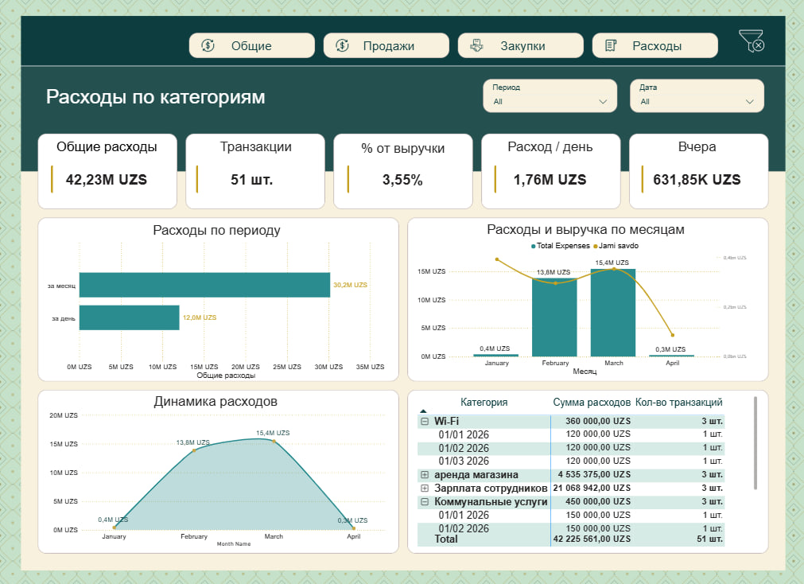

# 💎 Jewelry Business Intelligence (BI) Dashboard
### Sales, Inventory & Financial Analytics

---

## 🇺🇸 English Version

### 📊 Project Overview
This project is an advanced **Business Intelligence (BI) solution** designed for a jewelry retail store. It automates the tracking of sales, purchase costs, and operational expenses to calculate the real-time profitability and gold inventory balance.

### 🚀 Key Features
*   **Financial Tracking:** Real-time monitoring of Total Revenue, Gross Profit, and Net Margin.
*   **Inventory Control:** Tracking current gold stock levels (grams) across all categories (Rings, Earrings, etc.).
*   **Expense Management:** Detailed breakdown of operational costs like rent, salaries, and logistics.
*   **Trend Analysis:** Visualizing sales peaks to identify high-performing days and months.
*   **Vendor Insights:** Performance analysis of different factories/suppliers.

### 🛠 Tech Stack
*   **Power BI:** For interactive visualization and reporting.
*   **Power Query:** For automated data cleaning and transformation (ETL).
*   **DAX:** For complex measures including profit margin and inventory turnover.
*   **Source:** Structured data from Google Sheets/Excel.

---

## 🇺🇿 O'zbekcha Talqin

### 📊 Loyiha haqida qisqacha
Ushbu loyiha zargarlik do'koni uchun yaratilgan **Business Intelligence (BI)** yechimidir. Tizim savdo, xaridlar va operatsion xarajatlarni avvomatlashtirilgan tarzda kuzatib, real vaqt rejimidagi sof foyda va oltin zaxirasi miqdorini aniqlashga yordam beradi.

### 🚀 Asosiy imkoniyatlar
*   **Moliyaviy tahlil:** Umumiy tushum, yalpi foyda va sof foyda marginasini real vaqtda kuzatish.
*   **Ombor nazorati:** Oltin qoldig'ini (grammda) barcha kategoriyalar (uzuklar, ziraklar va h.k.) bo'yicha tahlil qilish.
*   **Xarajatlar menejmenti:** Ijara, ish haqi va logistika kabi xarajatlarning batafsil tahlili.
*   **Trendlar tahlili:** Savdo cho'qqilarini aniqlash orqali eng faol kunlar va oylarni vizuallashtirish.
*   **Hamkorlar tahlili:** Turli zavodlar va yetkazib beruvchilarning samaradorligini solishtirish.

### 🛠 Texnologiyalar
*   **Power BI:** Interaktiv vizualizatsiya va hisobotlar uchun.
*   **Power Query:** Ma'lumotlarni avtomatik tozalash va tayyorlash (ETL).
*   **DAX:** Murakkab hisob-kitoblar (foyda darajasi, ombor aylanmasi) uchun.
*   **Manba:** Google Sheets/Excel formatidagi ma'lumotlar.

---

## 🖼 Dashboard View / Ko'rinishi

---

## 🔗 Connections / Aloqa:
*   [**LinkedIn Profile**](https://www.linkedin.com/in/farruhjonasrorqulov/) 👈 
*   [**Power BI Portfolio**](https://app.powerbi.com/view?r=eyJrIjoiMTc0YTQ3M2ItZDQ5MS00MjcwLWJmMWItYjBkY2EzOGJmNGRjIiwidCI6IjI5ZGY5MmRmLWEzNmItNDFjMy05NDg0LWM3OGQ2NTdiOGUzNiIsImMiOjEwfQ%3D%3D&pageName=11ecf4265e80b6453e82)

---
**Developed by:** Asrorqulov Farruhjon
